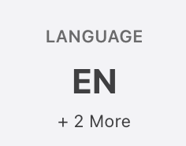
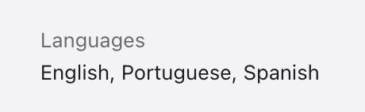
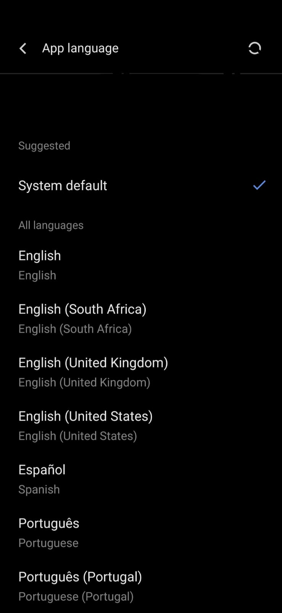

# NativePHP Mobile Locales

[](https://packagist.org/packages/developernauts/nativephp-mobile-locales)
[](https://packagist.org/packages/developernauts/nativephp-mobile-locales)

Declare the locales your NativePHP mobile app supports — once — and have the plugin wire the platform-native configuration on every iOS and Android build.

> **Build-time only.** This plugin runs during `php artisan native:run`. It writes native config files into the generated iOS and Android projects. It does **not** run at runtime, ship translations, switch locales, or persist user preferences.

## Requirements

- PHP 8.3+
- Laravel >= 12
- NativePHP Mobile v3

## Features

- Single source of truth for supported locales — one config array, both platforms.
- iOS: writes `CFBundleLocalizations` into `Info.plist`.
- Android: generates `res/xml/locales_config.xml` and references it from `AndroidManifest.xml`.
- Automatic format conversion (BCP 47 in, platform-native out).
- Idempotent — repeated builds produce the same output.

## Installation

```bash
composer require developernauts/nativephp-mobile-locales
```

Register the plugin with NativePHP:

```bash
php artisan native:plugin:register developernauts/nativephp-mobile-locales
```

Publish the config file:

```bash
php artisan vendor:publish --tag=nativephp-mobile-locales-config
```

## Configuration

`config/mobile-locales.php`

```php
return [
    'locales' => [
        'en',
        'en-GB',
    ],
];
```

Use [BCP 47](https://www.rfc-editor.org/rfc/rfc5646) tags (`en`, `pt-BR`, `en-GB`). Region subtags are optional. Tags are normalized automatically — `en_gb`, `EN-GB`, and `en-GB` resolve to the same entry.

## Native Platform Language Support

The plugin automatically syncs your configured locales into the native iOS and Android projects so the operating system can properly recognise which languages your app supports — without any manual Xcode or Android Studio configuration.

### iOS App Store Language Display

iOS reads the `CFBundleLocalizations` entries written to `Info.plist` and surfaces them in Settings and on the App Store listing.





### Android App Language Support

Android 13+ uses `locales_config.xml` to populate the per-app language picker in system Settings, allowing users to override the app language independently of the system locale.



---

## When are locale files generated?

The sync commands run automatically as a `pre_compile` plugin hook during:

- `php artisan native:run` (iOS and Android)
- `php artisan native:build` (iOS)
- `php artisan native:bundle` (iOS and Android)

After `native:install --force` the native project files are reset to their template state. The locale files will be restored on the next build/run/bundle.

## Generating locale files locally

To inspect or verify the generated files without running a full build, the sync commands can be run directly:

```bash
# Sync all platforms
php artisan nativephp-mobile-locales:sync

# iOS only — updates nativephp/ios/NativePHP/Info.plist and nativephp/ios/NativePHP-simulator-Info.plist
php artisan nativephp-mobile-locales:sync-ios

# Android only — creates nativephp/android/app/src/main/res/xml/locales_config.xml
php artisan nativephp-mobile-locales:sync-android

# Android manifest only — adds android:localeConfig to AndroidManifest.xml
php artisan nativephp-mobile-locales:sync-android-manifest
```

## How it works

On every build, the plugin reads the `locales` array and writes the platform-native equivalent into the generated native projects.

### iOS

`nativephp/ios/NativePHP/Info.plist`

```xml
<key>CFBundleLocalizations</key>
<array>
    <string>en</string>
    <string>en-GB</string>
</array>
```

### Android

`nativephp/android/app/src/main/res/xml/locales_config.xml`

```xml
<?xml version="1.0" encoding="utf-8"?>
<locale-config xmlns:android="http://schemas.android.com/apk/res/android">
    <locale android:name="en"/>
    <locale android:name="en-rGB"/>
</locale-config>
```

`nativephp/android/app/src/main/AndroidManifest.xml`

```xml
<application android:localeConfig="@xml/locales_config" ...>
```

BCP 47 (`en-GB`) is automatically converted to Android's resource qualifier format (`en-rGB`). Keep your config in BCP 47.

## Testing

```bash
composer test
```

The test suite covers locale normalisation, BCP 47 → platform-native format conversion, XML write/update logic for all three config files, platform routing, and idempotency.

## Notes

> [!NOTE]
> Running `php artisan native:plugin:validate` will report two warnings for this plugin:
> - *No bridge_functions defined in manifest*
> - *No native code directories found (resources/android or resources/ios)*
>
> Both are expected. This plugin ships no bridge functions and no native code — it works entirely through a `pre_compile` hook that writes config files into the generated native projects. The warnings do not affect functionality.

- Per-app language preferences on Android 13+ require both `locales_config.xml` and the manifest reference — both handled here.
- iOS reads `CFBundleLocalizations` at build time; rebuild after changing the config.
- An empty `locales` array is a valid no-op.
- Only two-part BCP 47 tags are supported (`en`, `en-GB`). Three-part tags such as `zh-Hans-CN` are rejected with an `InvalidArgumentException`.

## License

The MIT License (MIT). See [LICENSE.md](LICENSE.md).
